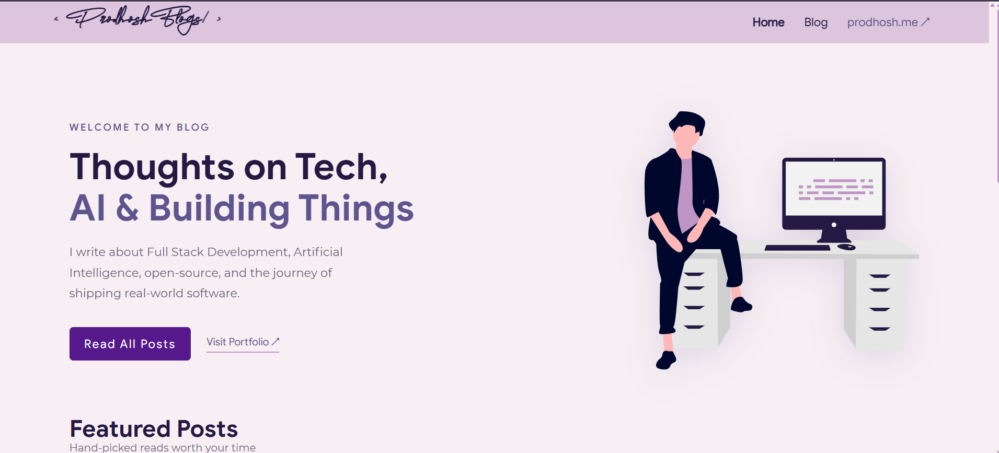
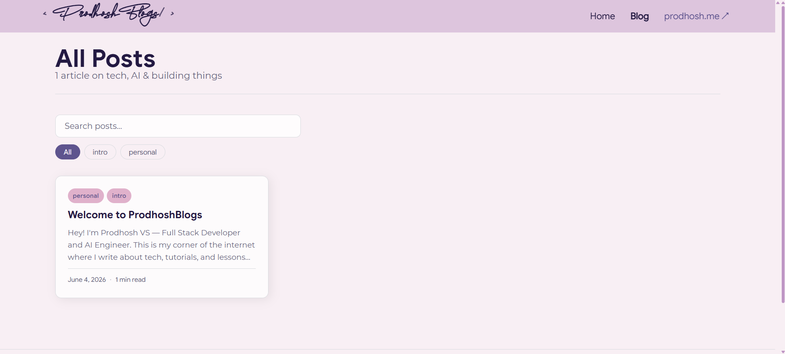

<div align="center">

<h1>ProdhoshBlogs</h1>

<p><em>My corner of the internet.</em></p>

<p>
  
  
  
  
  
</p>

<p>
  <a href="https://blog.prodhosh.me"></a>
  &nbsp;
  <a href="https://prodhosh.me"></a>
</p>

</div>

---

## Why I built this

I have been active on Medium and a few other writing platforms for a while now. Over time I realized two things.

First, I actually have a lot to share. Things I built, bugs I spent hours on, concepts I finally understood after weeks of confusion, tools that changed how I work. The kind of stuff that would have saved me time if someone had written it down clearly. So I started writing it down.

Second, none of those platforms felt like mine. Medium puts your content behind a paywall you did not set up. Other platforms bury your posts under an algorithm. You grow an audience but you are always one policy change away from losing reach. I wanted a place where I control everything, the design, the content, the experience.

So I built ProdhoshBlogs. It sits at `blog.prodhosh.me` right next to my portfolio. Same design, same feel, fully mine. No third party CMS, no lock-in, no subscriptions. Just me writing and publishing whenever I want.

---

## Screenshots

<div align="center">





</div>

---

## What I built

### Frontend

**Home page**
Has a hero section with the illustration from my portfolio and shows the most recent posts. First thing you see gives you a feel for who I am and what I write about.

**Blog listing**
All posts in one place with tag-based filtering and search. You can filter by topic or just search by keyword. Keeps things easy to browse as the post count grows.

**Individual post pages**
Each post renders full markdown with proper formatting for headings, code blocks, lists, and links. Shows reading time so you know what you are getting into before you start. Has a back button and links to my portfolio at the bottom.

**Custom 404**
A proper not-found page instead of the default one. Small thing but it matters for the overall feel.

**Responsive design**
Works on mobile, tablet, and desktop. Matches the exact purple color scheme from my portfolio so both sites feel like one cohesive thing.

### Backend

Built a full backend so I can write and publish posts without ever touching code or doing a redeploy. Posts live in a real serverless Postgres database. I write in markdown with a live preview, set tags, add an excerpt, and hit publish.

New posts go live within 60 seconds automatically using Next.js ISR (Incremental Static Regeneration). The page revalidates in the background so readers always get fast static pages and I still get instant publishing.

The whole writing experience is behind password protection so only I can access it.

---

## How publishing works

```
Write post in markdown  ->  Hit publish  ->  Post is in the database
                                                      |
                                                      v
                                         Next.js revalidates the page
                                         within 60 seconds automatically
                                                      |
                                                      v
                                         Post is live at blog.prodhosh.me
```

No git commits. No Vercel deploys. No waiting. Just write and publish.

---

## Tech stack

| What | Why |
|------|-----|
| Next.js 14 (Pages Router) | ISR support out of the box, posts go live fast without a full rebuild |
| Neon Postgres (AWS Singapore) | Serverless Postgres hosted on AWS ap-southeast-1, never pauses on the free tier, auto-resumes instantly |
| Drizzle ORM | Lightweight, clean database queries without the overhead of heavier ORMs |
| CSS Modules | Scoped styles that match the exact approach used in my portfolio |
| Vercel | Best Next.js hosting available, easy custom subdomain setup |

---

## Design

The blog intentionally matches [prodhosh.me](https://prodhosh.me) pixel for pixel on fonts, colors, and spacing. Same Agustina font for the logo, same Google Sans for body text, same purple palette throughout. The idea is that both sites feel like one place, not two separate things that happen to share a domain.

---

<div align="center">

Made by [Prodhosh VS](https://prodhosh.me)

</div>
